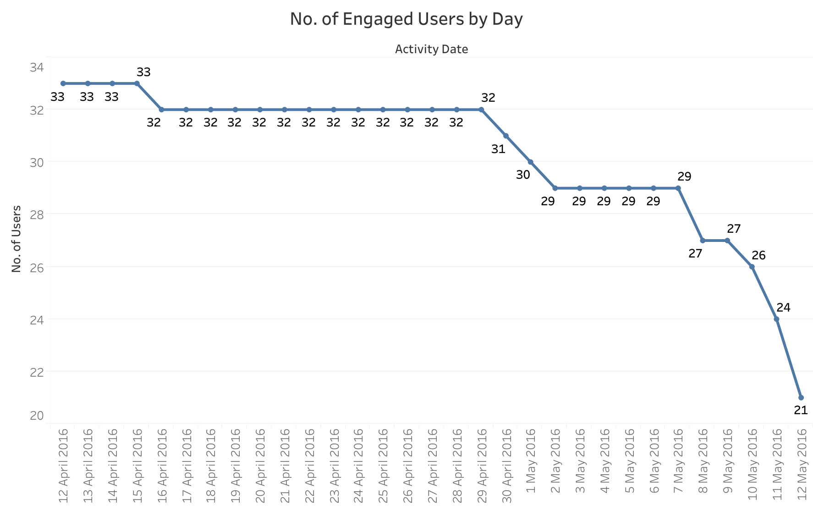
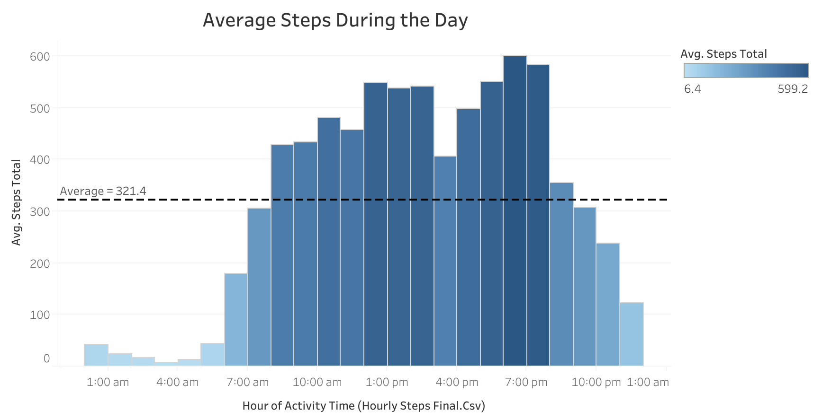
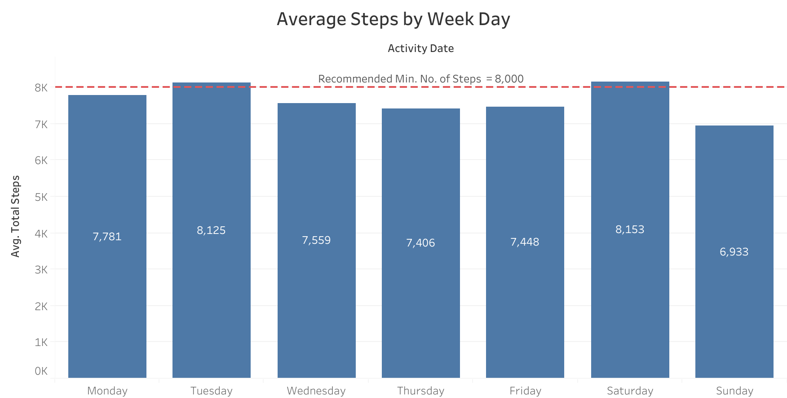
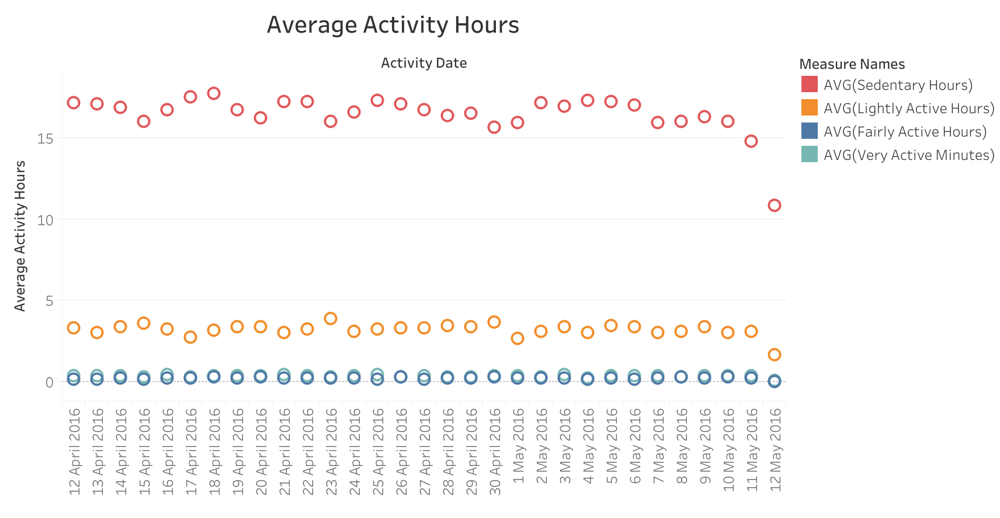
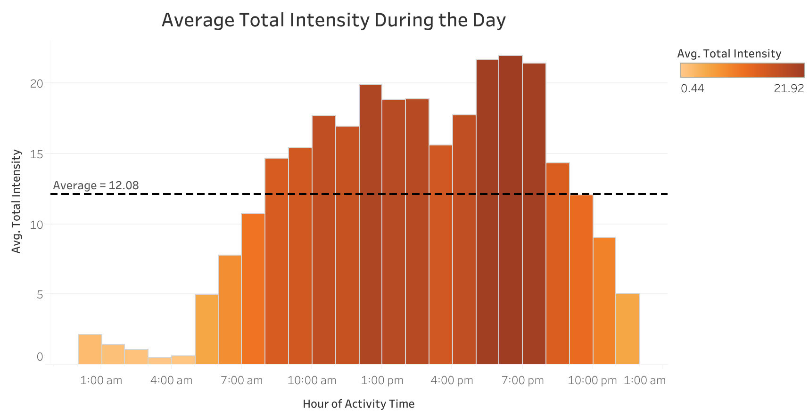
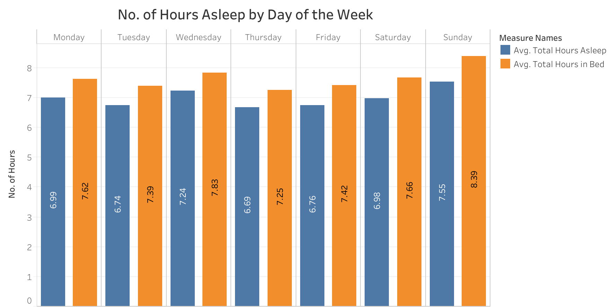

This is a capstone project that I have recently completed as part of the [Google Data Analytics Professional Certificate](https://www.coursera.org/professional-certificates/google-data-analytics). Course participants can learn the following:

* Gain an immersive understanding of the practices and processes used by a junior or associate data analyst in their day-to-day job
* Learn key analytical skills (data cleaning, analysis, & visualization) and tools (spreadsheets, SQL, R programming, Tableau)
* Understand how to clean and organize data for analysis, and complete analysis and calculations using spreadsheets, SQL and R programming
* Learn how to visualise and present data findings in dashboards, presentations and commonly used visualisation platforms

The analysis follows the six steps of data analysis taught in the Google programme: Ask, Prepare, Process, Analyse, Share, and Act.

## Introduction

I am a junior data analyst working on the marketing analyst team at Bellabeat, a high-tech manufacturer of health-focused products for women. I have been asked to focus on one of Bellabeat’s products and analyse smart device data to gain insight into how consumers are using their smart devices. The insights gained from this analysis will help guide marketing strategy for Bellabeat. I will present my analysis to the Bellabeat executive team, together with high-level recommendations for Bellabeat’s marketing strategy.

### About the Company

Bellabeat was founded by Urška Sršen and Sando Mur in 2014. Collecting data on activity, sleep, stress, and reproductive health has allowed Bellabeat to empower women with knowledge about their own health and habits. By 2016, Bellabeat had opened offices around the world and launched multiple products. Bellabeat products became available through a growing number of online retailers in addition to their own e-commerce channel on [their website](https://bellabeat.com/).

### Characters and Products
#### Characters
* Urška Sršen: Bellabeat’s cofounder and Chief Creative Officer
* Sando Mur: Mathematician and Bellabeat’s cofounder; key member of the Bellabeat executive team
* Bellabeat marketing analytics team: A team of data analysts responsible for collecting, analyzing, and reporting
data that helps guide Bellabeat’s marketing strategy. You joined this team six months ago and have been busy
learning about Bellabeat’s mission and business goals — as well as how I, as a junior data analyst, can help
Bellabeat achieve them.

#### Products
* Bellabeat app: The Bellabeat app provides users with health data related to their activity, sleep, stress, menstrual cycle, and mindfulness habits. This data can help users better understand their current habits and make healthy decisions. The Bellabeat app connects to their line of smart wellness products.
* Leaf: Bellabeat’s classic wellness tracker can be worn as a bracelet, necklace, or clip. The Leaf tracker connects to the Bellabeat app to track activity, sleep, and stress.
* Time: This wellness watch combines the timeless look of a classic timepiece with smart technology to track user activity, sleep, and stress. The Time watch connects to the Bellabeat app to provide you with insights into your daily wellness.
* Spring: This is a water bottle that tracks daily water intake using smart technology to ensure that you are appropriately hydrated throughout the day. The Spring bottle connects to the Bellabeat app to track your hydration levels.
* Bellabeat membership: Bellabeat also offers a subscription-based membership program for users. Membership gives users 24/7 access to fully personalized guidance on nutrition, activity, sleep, health and beauty, and mindfulness based on their lifestyle and goals.

## Step 1: Ask
### Business Task
To identify and analyse trends in smart device usage data in order to gain insights into how consumers use non-Bellabeat smart devices. These insights will then guide the marketing strategy for the company.

### Key Stakeholders
* Urška Sršen — Bellabeat’s cofounder and Chief Creative Officer
* Sando Mur — Bellabeat’s cofounder and key member of the Bellabeat executive team
* Bellabeat marketing analytics team

### Guiding Questions for the Analysis
1. What are some trends in smart device usage?
2. How could these trends apply to Bellabeat customers?
3. How could these trends help influence Bellabeat marketing strategy?

## Step 2: Prepare
### Data Source Used
The data source used for this case study is [FitBit Fitness Tracker Data](https://www.kaggle.com/datasets/arashnic/fitbit). This dataset is stored in Kaggle and was made available through Möbius under a public domain licence. Variation between output represents use of different types of Fitbit trackers and individual tracking behaviours or preferences.

### Dataset Information
This dataset was generated by respondents to [a distributed survey via Amazon Mechanical Turk](https://zenodo.org/records/53894#.X9oeh3Uzaao) between 12/3/2016 and 12/5/2016. Thirty eligible Fitbit users consented to the submission of personal tracker data, including minute-level output for physical activity, heart rate, and sleep monitoring.

The data contains 18 CSV files of anonymised user information, and is organised in long format. Each row represents a specific time interval with corresponding data points such as activity level, heart rate, and sleep patterns.

The data was downloaded from Kaggle and stored in the local drive on my Windows laptop.

### Data Credibility and Limitations
A good dataset is ROCCC, which stands for:

* Reliable
* Original
* Comprehensive
* Current
* Cited

Let us then examine the FitBit fitness tracker data available based on the ROCCC criteria.

* **Reliable**: The data is not reliable due to the small sample size of 30 respondents. This is comparatively small to the [millions of users](https://bellabeat.com/about-us/) Bellabeat claims to have. The absence of demographic data such as age and sex further diminishes the reliability of this dataset.
* **Original**: The dataset is not original as it was generated by respondents to a distributed survey via Amazon Mechanical Turk.
* **Comprehensive**: The dataset is not comprehensive as only 30 FitBit users consented to submit personal tracker data. There is also a lack of information on user demographics, which could then reflect sampling bias.
* **Current**: The data is not current because the it was collected between 12 March 2016 and 12 May 2016. This data may not be representative of the current trends in the smart device market.
* **Cited**: The dataset was created by Amazon Mechanical Turk. However, its credibility remains uncertain due to the lack of information regarding the reliability of the source.

Sršen did mention to me that this data set might have some limitations, and encouraged me to consider adding another data to help address those limitations as I begin to work more with this data. While specific additional data sources are not mentioned, exploring and incorporating complementary datasets can provide a more comprehensive understanding of smart device usage and enhance the credibility of the analysis. I searched for similar datasets that might make up for the deficiencies in this dataset, but I could not find any forthcoming datasets.

## Step 3: Process
### Dataset Files Used for the Analysis

For this analysis, I will make use of the following datasets:

* dailyActivity_merged.csv
* dailySleep_merged.csv
* hourlyIntensities_merged.csv
* hourlySteps_merged.csv
* weight_info.csv

Seeing the file names of some of the data already indicated that I will need to change the table and even the column names, so as to conform to accepted dataset naming conventions.

### Tools Used for Data Wrangling

I have opted to use MySQL Workbench to begin the data wrangling process. I previously used SQLite in an earlier introductory SQL course I took at the end of 2024, and learnt to use Google BigQuery during this Google Data Analytics course. For this analysis, I am using MySQL to demonstrate my versatility with various SQL platforms.

### Data Upload and Familiarisation in MySQL 
```{r include=FALSE}
library(RMariaDB)
fitabase_data <- dbConnect(RMariaDB::MariaDB(),dbname='fitabase_data',username='root',password='FenderTele2!', host='localhost',port=3306,mysql = TRUE)
knitr::opts_chunk$set(connection = "fitabase_data")
```

I uploaded the datasets from Kaggle into MySQL, and placed them under the database/schema fitabase_data which I have created. Using the table import wizard in MySQL, I created new tables as follows:

* daily_activity for dailyActivity_merged.csv
* daily_sleep for dailySleep_merged.csv
* hourly_intensities for hourlyIntensities_merged.csv
* hourly_steps for hourlySteps_merged.csv
* weight_info for weight_info.csv

After completing the upload of the datasets, I proceeded to explore the raw data in each table using the ```SELECT``` statement.
```{sql connection=fitabase_data}
SELECT * FROM daily_activity LIMIT 6;
```
```{sql connection=fitabase_data}
SELECT * FROM daily_sleep LIMIT 6;
```
```{sql connection=fitabase_data}
SELECT * FROM weight_info LIMIT 6;
```
```{sql connection=fitabase_data}
SELECT * FROM hourly_steps LIMIT 6;
```
```{sql connection=fitabase_data}
SELECT * FROM hourly_intensities LIMIT 6;
```

### Obtaining the Number of Users Represented in the Datasets

I used the ```COUNT``` function with the ```DISTINCT``` clause to find out how many users contributed to the various datasets. 

```{sql connection=fitabase_data}
SELECT COUNT(DISTINCT daily_activity.Id) AS users_activity,
COUNT(DISTINCT daily_sleep.Id) AS users_sleep,
COUNT(DISTINCT weight_info.Id) AS users_weight 
FROM daily_activity, daily_sleep, weight_info;
```

The collected data only contained records from 33 users, and not all of them used all of the functions. Out of the the 33 users, only 24 users utilise the sleep tracker, while only eight users have used the weight log. The number of weight log users are too little to perform any significant analysis. I find that the lack of users providing data will certainly create a data bias; 33 users is definitely a very small sample, not reflecting the whole population.

However, some preliminary insights can already be drawn from this:

* Not every user utilises the sleep tracker and weight log.
* The weight log is the least popular function used in the FitBit. It may signify that it is irrelevant to users or may not be very easy to use. Further analysis would be required to shed light on this function.

### Data Transformation

Seeing that the column names are in camel case, I decided to change the column names to snake case, which is the standard naming convention for many programming languages, such as R and Python. I have done this by creating a new table and using the ```ALTER TABLE``` statement with the ```RENAME COLUMN``` clause.

```
CREATE TABLE activity_daily AS (SELECT * FROM daily_activity);
ALTER TABLE activity_daily
RENAME COLUMN Id to user_id,
RENAME COLUMN ActivityDate to activity_date,
RENAME COLUMN TotalSteps to total_steps,
RENAME COLUMN TotalDistance to total_distance,
RENAME COLUMN TrackerDistance to tracker_distance,
RENAME COLUMN LoggedActivitiesDistance to logged_activities_distance,
RENAME COLUMN VeryActiveDistance to very_active_distance,
RENAME COLUMN ModeratelyActiveDistance to moderately_active_distance,
RENAME COLUMN LightActiveDistance to light_active_distance,
RENAME COLUMN SedentaryActiveDistance to sedentary_active_distance,
RENAME COLUMN VeryActiveMinutes to very_active_minutes,
RENAME COLUMN FairlyActiveMinutes to fairly_active_minutes,
RENAME COLUMN LightlyActiveMinutes to lightly_active_minutes,
RENAME COLUMN SedentaryMinutes to  sedentary_minutes,
RENAME COLUMN Calories to calories;

CREATE TABLE sleep_daily AS (SELECT * FROM daily_sleep);
ALTER TABLE sleep_daily
RENAME COLUMN Id to user_id,
RENAME COLUMN SleepDay to sleep_day,
RENAME COLUMN TotalSleepRecords to total_sleep_records,
RENAME COLUMN TotalMinutesAsleep to total_minutes_asleep,
RENAME COLUMN TotalTimeInBed to total_time_in_bed;

CREATE TABLE steps_hourly AS (SELECT * FROM hourly_steps);
ALTER TABLE steps_hourly 
RENAME COLUMN Id to user_id, 
RENAME COLUMN ActivityHour to activity_hour,
RENAME COLUMN StepTotal to steps_total;

CREATE TABLE intensities_hourly AS (SELECT * FROM hourly_intensities);
ALTER TABLE intensities_hourly 
RENAME COLUMN Id to user_id, 
RENAME COLUMN ActivityHour to activity_hour,
RENAME COLUMN TotalIntensity to total_intensity,
RENAME COLUMN AverageIntensity to average_intensity;
```

The new table names to be used are as follows:

* activity_daily for dailyActivity_merged.csv
* sleep_daily for dailySleep_merged.csv
* intensities_hourly for hourlyIntensities_merged.csv
* steps_hourly for hourlySteps_merged.csv

```{sql connection=fitabase_data}
SELECT * FROM activity_daily LIMIT 6;
```
```{sql connection=fitabase_data}
SELECT * FROM sleep_daily LIMIT 6;
```
```{sql connection=fitabase_data}
SELECT * FROM steps_hourly LIMIT 6;
```
```{sql connection=fitabase_data}
SELECT * FROM intensities_hourly LIMIT 6;
```

Now I would like to know the data types of each column. To do that, I used the ```DESCRIBE``` statement.

```{sql connection=fitabase_data}
DESCRIBE activity_daily;
```
```{sql connection=fitabase_data}
DESCRIBE sleep_daily;
```
```{sql connection=fitabase_data}
DESCRIBE steps_hourly;
```
```{sql connection=fitabase_data}
DESCRIBE intensities_hourly;
```

I noticed that the data types for the recorded dates in each table are not in the ```DATE``` data type, but are rather in the ```TEXT``` data type. Before this data can be used for analysis, I will have to convert the ```TEXT``` data type to the ```DATE``` or ```DATETIME``` data type by using the ```STR_TO_DATE``` statement.

Apart from the activity_daily table, both the date and time are found in the relevant date columns of the other tables.

I then proceeded to replace the string data in the date columns with the correct format for the data type conversion. I also have included a column for the day of the week in each dataset by using the ```DAYNAME``` function on the dates.

For the activity_daily dataset, only date data is available.
```
CREATE TABLE activity_daily_dtype_conv AS (SELECT * FROM activity_daily);
UPDATE activity_daily_dtype_conv SET activity_date=(STR_TO_DATE(activity_date, '%m/%d/%Y'));
ALTER TABLE activity_daily_dtype_conv MODIFY COLUMN activity_date date;
CREATE TABLE activity_daily_date AS
(SELECT user_id,
activity_date,
DAYNAME(activity_date) AS day_name,
total_steps,
total_distance,
tracker_distance,
logged_activities_distance,
very_active_distance,
moderately_active_distance,
light_active_distance,
sedentary_active_distance,
very_activ_minutes,
fairly_active_minutes,
lightly_active_minutes,
sedentary_minutes,
calories
FROM activity_daily_dtype_conv);
```

As for the other datasets, both date and time data are available. After converting the date and time data in the relevant columns to a suitable format, I converted the data type from string to the ```DATETIME``` data type. I separated the date and time in the relevant columns by using the ```CAST``` function on the datetime data columns.

```
CREATE TABLE sleep_daily_dtype_conv AS (SELECT * FROM sleep_daily);
UPDATE sleep_daily_dtype_conv SET sleep_day=(STR_TO_DATE(sleep_day, '%m/%d/%Y %r'));
ALTER TABLE sleep_daily_dtype_conv MODIFY COLUMN sleep_day datetime;
CREATE TABLE sleep_daily_date_time AS 
(SELECT user_id,
CAST(sleep_day AS DATE) AS sleep_date,
CAST(sleep_day AS TIME) AS sleep_time,
DAYNAME(CAST(sleep_day AS DATE)) AS day_name,
total_sleep_records, 
total_minutes_asleep,
total_time_in_bed
FROM sleep_daily_dtype_conv);

CREATE TABLE steps_hourly_dtype_conv AS (SELECT * FROM steps_hourly);
UPDATE steps_hourly_dtype_conv SET activity_hour=(STR_TO_DATE(activity_hour, '%m/%d/%Y %r'));
ALTER TABLE steps_hourly_dtype_conv MODIFY COLUMN activity_hour datetime;
CREATE TABLE steps_hourly_date_time AS
(SELECT user_id,
CAST(activity_hour AS DATE) AS activity_date,
CAST(activity_hour AS TIME) AS activity_time,
DAYNAME(CAST(activity_hour AS DATE)) AS day_name,
steps_total
FROM steps_hourly_dtype_conv);

CREATE TABLE intensities_hourly_dtype_conv AS (SELECT * FROM intensities_hourly);
UPDATE intensities_hourly_dtype_conv SET activity_hour=(STR_TO_DATE(activity_hour, '%m/%d/%Y %r'));
ALTER TABLE intensities_hourly_dtype_conv MODIFY COLUMN activity_hour datetime;
CREATE TABLE intensities_hourly_date_time AS
(SELECT user_id,
CAST(activity_hour AS DATE) AS activity_date,
CAST(activity_hour AS TIME) AS activity_time,
DAYNAME(CAST(activity_hour AS DATE)) AS day_name,
total_intensity,
average_intensity
FROM intensities_hourly_dtype_conv);
```

I then examined the datasets again to confirm that the correct format and data types are used. 

```{sql connection=fitabase_data}
SELECT * FROM activity_daily_date LIMIT 6;
```
```{sql connection=fitabase_data}
DESCRIBE activity_daily_date;
```
```{sql connection=fitabase_data}
SELECT * FROM sleep_daily_date_time LIMIT 6;
```
```{sql connection=fitabase_data}
DESCRIBE sleep_daily_date_time;
```
```{sql connection=fitabase_data}
SELECT * FROM steps_hourly_date_time LIMIT 6;
```{sql connection=fitabase_data}
DESCRIBE steps_hourly_date_time;
```
```{sql connection=fitabase_data}
SELECT * FROM intensities_hourly_date_time LIMIT 6;
```
```{sql connection=fitabase_data}
DESCRIBE intensities_hourly_date_time;
```

Now that the data has been formatted appropriately with the right data types and suitably named columns, I can now proceed to clean the data for analysis.

### Cleaning the Data for Analysis

I will need to check the datasets for duplicate and empty rows before analysis. Firstly, I will remove duplicate rows in the datasets. After that, I will remove rows with empty values.

I will use the ```SELECT DISTINCT``` statement to extract only the distinct rows from the datasets and to remove duplicate rows in the datasets.

I used the ```COUNT``` statement to find the number of rows in each dataset, and used it together with the ```SELECT DISTINCT``` statement to obtain the number of distinct rows in the datasets for comparison.

```{sql connection=fitabase_data}
SELECT COUNT(*) FROM activity_daily_date;
```
```{sql connection=fitabase_data}
SELECT COUNT(*) FROM (SELECT DISTINCT * FROM activity_daily_date) AS distinct_rows;
```
```{sql connection=fitabase_data}
SELECT COUNT(*) FROM sleep_daily_date_time;
```
```{sql connection=fitabase_data}
SELECT COUNT(*) FROM (SELECT DISTINCT * FROM sleep_daily_date_time) AS distinct_rows;
```
```{sql connection=fitabase_data}
SELECT COUNT(*) FROM steps_hourly_date_time;
```
```{sql connection=fitabase_data}
SELECT COUNT(*) FROM (SELECT DISTINCT * FROM steps_hourly_date_time) AS distinct_rows;
```
```{sql connection=fitabase_data}
SELECT COUNT(*) FROM intensities_hourly_date_time;
```
```{sql connection=fitabase_data}
SELECT COUNT(*) FROM (SELECT DISTINCT * FROM intensities_hourly_date_time) AS distinct_rows;
```

There were three duplicate rows in the sleep_daily dataset, while there were no duplicate rows in the other datasets.

I then used the ```IS NULL``` operator to find any missing or empty values in my datasets, where I found that there were no empty fields in the datasets.

Finding that there are no empty fields in the datasets, I created finalised tables to be used for analysis.

```
CREATE TABLE daily_activity_final AS (SELECT * FROM activity_daily_date);

CREATE TABLE daily_sleep_final AS (SELECT DISTINCT * FROM sleep_daily_date_time);

CREATE TABLE hourly_steps_final AS (SELECT * FROM steps_hourly_date_time);

CREATE TABLE hourly_intensities_final AS (SELECT * FROM intensities_hourly_date_time);
```

Finally, I exported the finalised tables as .csv files. The names of the datasets to be used for analysis are:

* daily_activity_final.csv
* daily_sleep_final.csv
* hourly_steps_final.csv
* hourly_intensities_final.csv

```{r include=FALSE}
dbDisconnect(fitabase_data)
```


## Step 4: Analyse

Now that the data has been cleaned and organised, we can proceed to the analysis step. I made use of the exported .csv files from MySQL and imported them to R to carry out the analysis, ensuring that the right data types and formatting is stated for various columns.

```{r include=FALSE}
here::i_am("Google Data Analytics Capstone Project - Bellabeat Case Study (GitHub).rmd")
```

```{r message=FALSE}
library(tidyverse)
library(ggplot2)
library(lubridate)
library(dplyr)
library(janitor)
library(skimr)
library(readr)
```

```{r}
daily_activity_final <- read_csv("daily_activity_final.csv", col_types = cols(user_id = col_character(), activity_date = col_date(format = "%Y-%m-%d")));

daily_sleep_final <- read_csv("daily_sleep_final.csv", col_types = cols(user_id = col_character(), sleep_date = col_date(format = "%Y-%m-%d"), sleep_time = col_time(format = "%X")));

hourly_steps_final <- read_csv("hourly_steps_final.csv", col_types = cols(user_id = col_character(), activity_date = col_date(format = "%Y-%m-%d"), activity_time = col_time(format = "%X")));

hourly_intensities_final <- read_csv("hourly_intensities_final.csv", col_types = cols(user_id = col_character(), activity_date = col_date(format = "%Y-%m-%d"), activity_time = col_time(format = "%X")));
```

### User Types
Now that the data has been imported into R, I proceeded to find out what type of users are represented in the dataset. To do this, I defined a new dataframe called user_types, which I then exported as a .csv file to be used in Tableau.
```{r}
user_types <- daily_activity_final %>% group_by(user_id) %>% summarise(days_used=sum(n())) %>% mutate(user_type = case_when(
  days_used >= 1 & days_used <= 10 ~ "Light User",
  days_used >= 11 & days_used <= 20 ~ "Moderate User",
  days_used >= 21 & days_used <= 29 ~ "Heavy User",
  days_used >= 30 ~ "Everyday User"))
```
```{r}
head(user_types)
```
```
write.csv(user_types, "user_types.csv", row.names=FALSE)
```

### Data Summaries
I used the ```summary()``` function to obtain statistical information about the datasets.

```{r}
summary(daily_activity_final)
```
```{r}
summary(daily_sleep_final)
```
```{r}
summary(hourly_steps_final)
```
```{r}
summary(hourly_intensities_final)
```

Based on the statistical summaries, we can make the following observations:

* The average number of steps per day is 7,638, which is relatively low, compared to the [study by the U.S. Centres for Disease Control and Prevention (CDC)](https://archive.cdc.gov/#/details?url=https://www.cdc.gov/media/releases/2020/p0324-daily-step-count.html) suggesting 8,000-10,000 steps per day.
* Sedentary behaviour is defined by the [World Health Organisation](https://www.ncbi.nlm.nih.gov/books/NBK566046/) as 'time spent sitting or lying with low energy expenditure, while awake, in the context of occupational, educational, home and community settings, and transportation.' The average amount of time in sedentary activities is 991.2 min (16.52 h), which should be greatly reduced in favour of any level of physical activity.
* The average amount of time in light activities is 192.8 min (3.21 h), which suggests the participants were mostly lightly active. More activities of this kind of intensity can be used to replace sedentary behaviour.
* According to the [U.S. CDC](https://www.cdc.gov/sleep/about/?CDC_AAref_Val=https://www.cdc.gov/sleep/about_sleep/how_much_sleep.html), adults require at least 7 h of sleep. On average, users have 419.2 min (6.99 h) of sleep per day.

## Step 5: Share

I have made use of both R (the ```ggplot()``` function) and Tableau for the visualisations, to show my proficiency in using both software for creating data visualisations. The Tableau visualisation can be viewed [here](https://public.tableau.com/views/GoogleDataAnalyticsCapstoneProject-BellabeatCaseStudyVisualisationsDanielPoe/BellabeatCapstoneProjectStory?:language=en-GB&publish=yes&:sid=&:redirect=auth&:display_count=n&:origin=viz_share_link), where I have also created a story to summarise key findings.

### Number of Users with Recorded Data

Using the user_types.csv file exported from R, I proceeded to examine the proportion of user types in Tableau.


**Observations**: Although there are 33 users recorded in the dataset daily_activity_final, the number of users reflected for each calendar day was found to be decreasing. This means not all of the 33 users have used the tracker to record their activity throughout the one-month timeline. User engagement fell by 36% throughout the one-month period. Out of the 33 users, 24 of them have consistently logged their activity throughout the one-month period.

### Number of Steps


**Observations**: The histogram 'Average Steps During the Day' shows that users are more active from 8 am to 8 pm, recording the most number of steps from 5 to 8 pm, followed by 12 to 3 pm. These time periods seem to correspond to users leaving work and having their lunch break respectively. Users possibly were using these times to go to the gym or spending time on longer walks.

As mentioned earlier, the recommended minimum of steps per day is around 8,000-10,000 steps. On average, users are walking below that recommendation, except on Tuesdays and Saturdays, where they were most active.

```{r}
ggplot(data=daily_activity_final, aes(x=total_steps, y=calories)) + geom_point(aes(colour = calories)) + geom_smooth(method = "gam", formula = y ~ s(x, bs = "cs"), colour="darkorange2") + labs(title="Total Steps vs. Calories Burnt", x="Total Steps", y="Calories Burnt", colour="Calories")+theme(plot.title = element_text(hjust=0.5))
```

**Observations**: This visualisation indicates that with the greater number of steps, the greater the amount of calories is burnt, since logically, more energy is consumed with increased activity.

### Activity Patterns


**Observations**: The scatter plot reveals the predominant portion of the users' daily activities is heavily sedentary. This suggests that the users are mostly indoors and carrying out stationary activities like sitting or lying down. In terms of physical activity levels, users mostly carried out light-intensity activities.


**Observations**: Similar to the earlier histogram 'Average Steps During the Day,' this histogram indicates that users are most active between 5-8 pm, and fairly active between 12-3 pm. These time periods seem to correspond to users leaving work and having their lunch break respectively. Users may be using these times to go to the gym or spending time on longer walks.


**Observations**: The scatter plot shows that majority of users who had 5-9 h of sleep were found to be frequently involved in high intensity activities.

### Sleep


```{r}
ggplot(data=daily_sleep_final, aes(x=total_time_in_bed, y=total_minutes_asleep)) + geom_point(aes(colour = total_minutes_asleep)) + geom_smooth(method = lm, colour="darkorange2") + labs(title="Total Time Asleep vs. Total Time in Bed", x="Total Minutes in Bed", y="Total Minutes Asleep", colour="Total Minutes Asleep")+theme(plot.title = element_text(hjust=0.5))
```

**Observations**: There is a positive correlation between the time in bed and the time asleep. This means that in order to have good sleep quality, people need to go to bed on time.

Based on the statistical summary of daily_sleep_final, the average total time in bed is 458.5 min (7.64 h), while the average total time asleep is 419.2 min (6.99 h). This means that the users take around 39.3 min to fall asleep. According to the [Sleep Centre of Middle Tennessee](https://sleepcenterinfo.com/blog/how-long-to-fall-asleep/), it typically takes around 10 to 20 minutes to fall asleep, indicating that the users have problems falling asleep.


## Step 6: Act

Bellabeat has a mission to provide women with activity, sleep, stress, and reproductive health data, so as to help them discover more about their health and habits.

A larger data sample size would be necessary in order to carry out more in-depth analysis. Different types of data would also need to be collected in order to have a broader understanding in the analysis result; some of this additional data can include user demographics such as gender, age, and occupation. Having additional demographic data will help to remove bias in the datasets and analysis. Collection of more recent and up-to-date data will also increase the reliability of the analysis to learn about the current situation and trends.

### Key Findings

With that said, here are the key findings from this analysis:

* Not all users utilised the sleep tracker and weight log.
* The least popular feature in the fitness tracker is the weight log function.
* User engagement decreased by 36% throughout the one-month period.
* In terms of the days of the week, users were most active on Tuesdays and Saturdays.
* Most of the time is spent in sedentary activities, with some time spent on light-intensity activities.
* Users were active from 8 am to 8 pm, and were most active between 5 to 8 pm, followed by 12 to 3 pm.
* Although users have relatively sufficient sleep on average, they seemed to have problems falling asleep. The amount of sleep they have per day is inconsistent and often less than the recommended minimum of 7 h per day.


### Recommendations

Based on this analysis, I would propose the following recommendations:

* **Further Analysis on the Weight Log Function**

  Seeing that there were only eight out of 33 users who used the weight log function, data collection on it (e.g. in the form of a survey) should be conducted to understand why users do not use it. Such a study would provide user insights into the function and inform Bellabeat on how they can perhaps improve on the weight log function.

* **Promote Device Use while Sleeping**

  People tend to remove watches before going to sleep. Bellabeat should encourage device users to continue wearing their devices when going to bed, so that Bellabeat will be able to collect more data on users' sleep patterns. Users will also be able to gain insights from their sleep data and make helpful decisions for them to get enough sleep.

* **Sleep Notifications**

  Since users often do not have the recommended amount of sleep per day, we can consider to have a feature on the Bellabeat app that allows users to specify a time they desire to go to sleep. The app can then notify the user some time before that time to prepare going to sleep. Since users struggle to fall asleep, prompting them to go to bed earlier than the set time can help users to fall asleep on time and have sufficient rest.

* **Step and Activity Notifications**

  In order to encourage users to take more steps, Bellabeat can set up app notifications at different times of the day to make users conscious of the number of steps they have taken and motivate them to meet the daily minimum requirement of 8,00 steps by the U.S. CDC. Additional information on the health benefits of walking the daily recommended number of steps can also be included in the app to educate users about its benefits.

  Prolonged sedentary activity alerts can also be set up, which will prompt users to get up and engage in some form of physical activity like walking. Additional information can also be included in the app about the dangers of highly sedentary activity, such as information published by [WHO](https://www.ncbi.nlm.nih.gov/books/NBK566046/).

* **Online Campaign Recommendations**

  The online campaign should not portray the Bellabeat app as merely a fitness activity app. Rather, it should promote the app as a guide that will allow women to strike a balance between their personal and work lives, and to improve their health habits through education and daily app notifications.